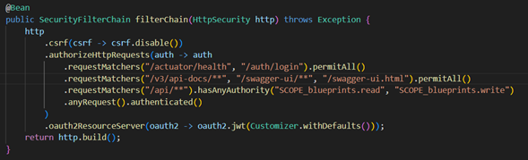
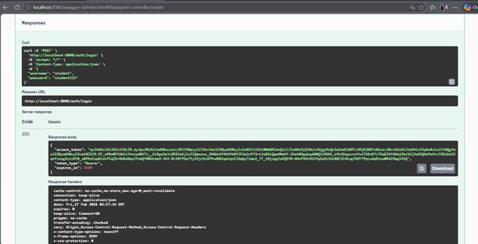

# Escuela Colombiana de Ingeniería Julio Garavito
## Arquitectura de Software – ARSW
### Laboratorio – Parte 2: BluePrints API con Seguridad JWT (OAuth 2.0)

Este laboratorio extiende la **Parte 1** ([Lab_P1_BluePrints_Java21_API](https://github.com/DECSIS-ECI/Lab_P1_BluePrints_Java21_API)) agregando **seguridad a la API** usando **Spring Boot 3, Java 21 y JWT (OAuth 2.0)**.  
El API se convierte en un **Resource Server** protegido por tokens Bearer firmados con **RS256**.  
Incluye un endpoint didáctico `/auth/login` que emite el token para facilitar las pruebas.

---

## Objetivos
- Implementar seguridad en servicios REST usando **OAuth2 Resource Server**.
- Configurar emisión y validación de **JWT**.
- Proteger endpoints con **roles y scopes** (`blueprints.read`, `blueprints.write`).
- Integrar la documentación de seguridad en **Swagger/OpenAPI**.

---

## Requisitos
- JDK 21
- Maven 3.9+
- Git

---

## Ejecución del proyecto
1. Clonar o descomprimir el proyecto:
   ```bash
   git clone https://github.com/DECSIS-ECI/Lab_P2_BluePrints_Java21_API_Security_JWT.git
   cd Lab_P2_BluePrints_Java21_API_Security_JWT
   ```
   ó si el profesor entrega el `.zip`, descomprimirlo y entrar en la carpeta.

2. Ejecutar con Maven:
   ```bash
   mvn -q -DskipTests spring-boot:run
   ```

3. Verificar que la aplicación levante en `http://localhost:8080`.

---

## Endpoints principales

### 1. Login (emite token)
```
POST http://localhost:8080/auth/login
Content-Type: application/json

{
  "username": "student",
  "password": "student123"
}
```
Respuesta:
```json
{
  "access_token": "eyJhbGciOiJSUzI1NiIsInR5cCI6IkpXVCJ9...",
  "token_type": "Bearer",
  "expires_in": 3600
}
```

### 2. Consultar blueprints (requiere scope `blueprints.read`)
```
GET http://localhost:8080/api/blueprints
Authorization: Bearer <ACCESS_TOKEN>
```

### 3. Crear blueprint (requiere scope `blueprints.write`)
```
POST http://localhost:8080/api/blueprints
Authorization: Bearer <ACCESS_TOKEN>
Content-Type: application/json

{
  "name": "Nuevo Plano"
}
```

---

## Swagger UI
- URL: [http://localhost:8080/swagger-ui/index.html](http://localhost:8080/swagger-ui/index.html)
- Pulsa **Authorize**, ingresa el token en el formato:
  ```
  Bearer eyJhbGciOi...
  ```

---

## Estructura del proyecto
```
src/main/java/co/edu/eci/blueprints/
  ├── api/BlueprintController.java       # Endpoints protegidos
  ├── auth/AuthController.java           # Login didáctico para emitir tokens
  ├── config/OpenApiConfig.java          # Configuración Swagger + JWT
  └── security/
       ├── SecurityConfig.java
       ├── MethodSecurityConfig.java
       ├── JwtKeyProvider.java
       ├── InMemoryUserService.java
       └── RsaKeyProperties.java
src/main/resources/
  └── application.yml
```

---

## Actividades propuestas
1. Revisar el código de configuración de seguridad (`SecurityConfig`) e identificar cómo se definen los endpoints públicos y protegidos.
2. Explorar el flujo de login y analizar las claims del JWT emitido.
3. Extender los scopes (`blueprints.read`, `blueprints.write`) para controlar otros endpoints de la API, del laboratorio P1 trabajado.
4. Modificar el tiempo de expiración del token y observar el efecto.
5. Documentar en Swagger los endpoints de autenticación y de negocio.

---
# REPORTE DE LABORATORIO
---
### INTEGRANTES:
      - Laura Alejandra Venegas Piraban  
      - Sergio Alejandro Idarraga Torres  

## 1. Código de configuración de seguridad

En el archivo `SecurityConfig.java`, se define la configuración de seguridad para la API mediante el método `filterChain(HttpSecurity http)`, anotado con `@Bean`. Este método construye la cadena de filtros de seguridad que determina qué rutas son públicas y cuáles requieren autenticación.

<div align="center">
  
</div>

### Endpoints públicos (sin autenticación)

```java
.requestMatchers("/actuator/health", "/auth/login").permitAll()
.requestMatchers("/v3/api-docs/**", "/swagger-ui/**", "/swagger-ui.html").permitAll()
```

Estas líneas declaran que los siguientes recursos son accesibles **sin ningún token**:

| Ruta | Propósito |
|------|-----------|
| `/auth/login` | Endpoint didáctico para emitir tokens JWT |
| `/actuator/health` | Verificación del estado de la aplicación |
| `/v3/api-docs/**`, `/swagger-ui/**`, `/swagger-ui.html` | Documentación OpenAPI / Swagger UI |

### Endpoints protegidos (requieren token JWT)

```java
.requestMatchers("/api/**").hasAnyAuthority("SCOPE_blueprints.read", "SCOPE_blueprints.write")
.anyRequest().authenticated()
```

- Todos los endpoints bajo `/api/**` requieren que el token JWT contenga al menos uno de los scopes: `blueprints.read` (lectura) o `blueprints.write` (escritura). Spring Security prefija automáticamente `SCOPE_` al comparar las autoridades del token.
- Cualquier otra ruta no listada explícitamente exige que el usuario esté autenticado (token válido), pero sin exigir un scope específico.

### Deshabilitación de CSRF

```java
.csrf(csrf -> csrf.disable())
```

Se deshabilita la protección CSRF porque la API es **stateless** (no usa sesiones ni cookies de sesión). Los tokens JWT se envían en el encabezado `Authorization`, lo que ya protege contra este tipo de ataque.

### Configuración como Resource Server

```java
.oauth2ResourceServer(oauth2 -> oauth2.jwt(Customizer.withDefaults()))
```

Indica a Spring Security que esta aplicación actúa como un **OAuth2 Resource Server**: toda petición a rutas protegidas debe incluir un token JWT válido en el encabezado `Authorization: Bearer <token>`. El token se valida usando la clave pública RSA configurada en `JwtDecoder`.

### Codificación de contraseñas y claves RSA

```java
@Bean PasswordEncoder passwordEncoder() { return new BCryptPasswordEncoder(); }

@Bean JwtDecoder jwtDecoder(JwtKeyProvider keyProvider) { ... }  // valida tokens con clave pública RSA
@Bean JwtEncoder jwtEncoder(JwtKeyProvider keyProvider) { ... }  // firma tokens con clave privada RSA
```

- Las contraseñas de los usuarios se almacenan hasheadas con **BCrypt**.
- Los tokens se firman con el algoritmo **RS256** (RSA + SHA-256): el servidor firma con la clave privada y verifica con la clave pública.

---

## 2. Flujo de login y claims del JWT emitido

### Flujo de autenticación

El endpoint `POST /auth/login` en `AuthController.java` implementa el flujo didáctico de emisión de tokens:


**Paso a paso:**

1. El cliente envía `username` y `password` en el cuerpo JSON.
2. `InMemoryUserService.isValid()` busca el usuario en el mapa en memoria y compara la contraseña recibida con el hash BCrypt almacenado.
3. Si la validación falla, se retorna `HTTP 401` con `{"error": "invalid_credentials"}`.
4. Si es exitosa, se construye el conjunto de claims y se firma el token con la clave privada RSA.
5. Se retorna un objeto con el token, el tipo `Bearer` y el tiempo de expiración.

<div align="center">
  
</div>

### Usuarios disponibles (en memoria)

| Usuario | Contraseña |
|---------|------------|
| `student` | `student123` |
| `assistant` | `assistant123` |

Ambos usuarios reciben **exactamente los mismos scopes** al autenticarse.


| Claim | Valor | Descripción |
|-------|-------|-------------|
| `iss` | valor de `blueprints.security.issuer` en `application.yml` | Emisor del token |
| `iat` | timestamp actual | Momento en que se emitió el token |
| `exp` | `iat + tokenTtlSeconds` (default 3600) | Momento de expiración |
| `sub` | `"student"` o `"assistant"` | Sujeto / usuario autenticado |
| `scope` | `"blueprints.read blueprints.write"` | Scopes autorizados (separados por espacio) |


> El token **no contiene** la contraseña ni información sensible. Cualquier receptor puede leer el payload, pero solo el servidor puede **verificar su firma** usando la clave pública RSA, garantizando su autenticidad e integridad.

---

## Lecturas recomendadas
- [Spring Security Reference – OAuth2 Resource Server](https://docs.spring.io/spring-security/reference/servlet/oauth2/resource-server/index.html)
- [Spring Boot – Securing Web Applications](https://spring.io/guides/gs/securing-web/)
- [JSON Web Tokens – jwt.io](https://jwt.io/introduction)

---

## Licencia
Proyecto educativo con fines académicos – Escuela Colombiana de Ingeniería Julio Garavito.
